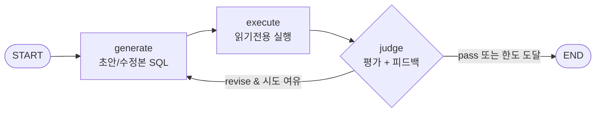

# Self-Correction 루프 설계

> 생성한 SQL 을 실제로 실행해보고, 에러·빈 결과·의미 오류가 나오면 그 피드백을
> 다시 모델에 줘 수정본을 만들게 하는 루프. LangGraph 의 **조건부 엣지**로
> "통과할 때까지(혹은 한도까지) 고친다".

관련 코드: `core/correction_graph.py`, `core/llm_client.py`,
`main.build_generation_prompt` / `main.generate_sql_corrected`.

## 왜 필요한가 (Motivation)

단일샷(single-shot) 생성은 다음 이유로 자주 틀린다.

- **구문/스키마 오류**: 없는 컬럼명, 예약어 테이블(`order`) 따옴표 누락, 잘못된
  조인 경로 → DB 가 즉시 에러를 낸다.
- **빈 결과(empty result)**: 코드값 매핑 실수(`gender='여성'` vs `'F'`,
  `type='gold'`), 잘못된 필터로 0행이 나온다. 구문은 맞지만 답이 아니다.
- **의미 오류(semantic)**: 실행은 되고 행도 나오지만 질문의 의도와 다른 컬럼·
  집계를 쓴다.

핵심 통찰: **틀린 SQL 대부분은 그 자체가 신호를 준다.** DB 실행 결과(에러/행 수)
는 공짜로 얻는 정답에 가까운 검증 신호다. 이 신호를 모델에 되먹이면 한 번에
맞히지 못한 쿼리를 스스로 고칠 수 있다. 이것이 self-correction / reflexion
계열의 표준 패턴이며, Text-to-SQL 에서 execution accuracy 를 끌어올리는 가장
검증된 기법 중 하나다.

## 패턴: generate → execute → judge → revise



- **generate**: 질문 + 추려진 스키마로 SQL 을 만든다. 재시도일 때는 직전 SQL 과
  피드백을 프롬프트에 실어 "고쳐서 다시 출력"하게 한다
  (`build_generation_prompt(..., correction=...)`).
- **execute**: SQL 을 **읽기 전용**으로 실행한다(항상 `rollback`, 어떤 변경도
  남기지 않음). 성공이면 행 수와 표본 행, 실패면 PostgreSQL 오류 메시지를 담는다.
- **judge**: 두 신호를 합쳐 `verdict`(`pass`/`revise`)와 개선 피드백을 만든다.
- **조건부 엣지**: `verdict == revise` 이고 시도 여유가 있으면 generate 로
  되돌아가고, 아니면 종료한다.

## 두 가지 피드백 신호를 결합한다

| 신호 | 출처 | 성격 | 잡아내는 오류 |
|------|------|------|----------------|
| 실행 신호 | DB 실행 | 결정적(deterministic) | 구문/스키마 오류, 빈 결과 |
| judge 신호 | LLM judge | 의미적(semantic) | 엉뚱한 컬럼·집계·누락 조건 |

**실행이 실패한 경우엔 judge LLM 을 호출하지 않는다.** 오류 메시지가 곧 명확한
수정 근거이므로, judge 노드가 결정적으로 `revise` + 오류 기반 피드백을 만든다.
이로써 (1) 불필요한 LLM 호출/비용을 줄이고 (2) 실행 오류는 **항상** 재시도되도록
보장한다. 실행이 성공한 경우에만 judge LLM 이 "이 결과가 질문에 답하는가"를
평가한다.

> 빈 결과(0행)는 *의심스럽지만 항상 틀린 건 아니다* — `count(*)` 같은 집계나
> 실제로 데이터가 없는 경우 0행도 정답일 수 있다. 그래서 0행 자체를 자동 revise
> 로 두지 않고 judge 의 판단에 맡긴다(프롬프트에 "0행은 의심하되 단정 말라"를
> 명시).

## 왜 LangGraph 조건부 엣지인가

이 루프의 본질은 **상태(state)를 들고 도는 순환 그래프**다. 직접 `while` 로 짜도
되지만 LangGraph 를 쓰면:

- **분기 로직이 데이터로 분리**된다. `route_after_judge` 는 상태만 보고
  `"generate"`/`"end"` 를 돌려주는 **순수 함수** → DB/LLM 없이 단위 테스트 가능
  (`tests/test_correction_graph.py`).
- **상태 스키마가 명시적**(`CorrectionState` TypedDict)이고, `history` 는 리듀서
  (`operator.add`)로 시도마다 자동 누적되어 관찰·디버깅이 쉽다.
- 체크포인트/스트리밍/시각화 등 그래프 인프라를 나중에 얹기 쉽다.
- 노드(generate/execute/judge) 경계가 분명해 각 단계를 독립적으로 교체·확장
  (예: judge 를 룰 기반으로 바꾸거나, validate 노드 추가)하기 좋다.

LangGraph 는 **오케스트레이션 용도로만** 쓴다. LLM 호출 자체는 CLAUDE.md 규약대로
`core/llm_client.py` 를 경유한다(langchain 모델 래퍼 불필요 → 의존성 최소화).

## 상태와 종료 보장

`CorrectionState` 주요 필드: `sql`(최신), `exec_ok`/`exec_error`/`row_count`/
`sample_rows`(실행 신호), `verdict`/`feedback`(judge 신호), `attempts`/
`max_attempts`, `history`(시도 누적).

**유한 종료**는 `attempts >= max_attempts` 가드가 보장한다(기본 3, `T2S_MAX_
CORRECTIONS` 로 조정). LangGraph `recursion_limit` 은 안전망일 뿐 실제 종료 조건은
시도 한도다. judge 출력이 파싱 불가하면 `pass` 로 간주해 **루프를 늘리지 않는
쪽**으로 처리한다(비용 폭주 방지; 한도가 추가로 보호).

## 기존 계약과의 호환 (A/B 가능)

평가 인프라의 안정 계약은 `generate_sql(question, schema_text) -> str` 이다.

- `main.generate_sql` — **단일샷, 그대로 유지**(baseline).
- `main.generate_sql_corrected` — **동일 시그니처**의 self-correction 진입점.
  실행 검증을 위해 자체 DB 연결을 열고 닫는다.

덕분에 코드 수정 없이 진입점만 바꿔 두 방식을 비교할 수 있다.

```powershell
# baseline
uv run python -m eval.evaluate
# self-correction (조건부 엣지 루프)
$env:T2S_ENTRYPOINT = "main:generate_sql_corrected"
uv run python -m eval.evaluate --note "self-correction"
```

두 실행 모두 `eval.run`/`eval.result` 이력에 남으므로(엔트리포인트·정확도·틀린
내역 포함) 효과를 정량 비교할 수 있다.

## 환경변수

| 변수 | 기본값 | 의미 |
|------|--------|------|
| `T2S_MAX_CORRECTIONS` | `3` | 최대 시도 횟수(초안 1 + 수정 N-1) |
| `T2S_JUDGE_MODEL` | `main.MODEL` | judge 에 쓸 모델(생성기와 분리 가능) |
| `T2S_ENTRYPOINT` | `main:generate_sql` | 평가 진입점 — 루프로 바꾸려면 `main:generate_sql_corrected` |
| `LANGSMITH_TRACING` / `LANGSMITH_API_KEY` | (없음) | 설정 시 트레이싱 ON (아래 트레이싱 절) |
| `T2S_NO_TRUSTSTORE` | (없음) | `1` 이면 OS 인증서 저장소 주입 비활성화 |

## 트레이싱 (LangSmith)

self-correction 은 한 번에 안 맞히는 게 정상이라, "루프가 실제로 무엇을 하고
있는지"(초안 → 실행 결과 → judge 판정 → 수정본)를 들여다보는 게 중요하다. 정확도
숫자만으로는 *루프가 돌긴 했는지, judge 가 너무 관대한지, 수정이 외려 망쳤는지*를
알 수 없다. LangSmith 로 매 시도를 트레이스 트리로 남긴다.

**켜는 법** — `.env`(또는 환경)에 아래를 추가하면 끝이다. 코드 변경은 없다.

```ini
LANGSMITH_TRACING=true
LANGSMITH_API_KEY=<your-langsmith-key>
LANGSMITH_PROJECT=text-to-sql        # 선택(미지정 시 default 프로젝트)
# LANGSMITH_ENDPOINT=https://api.smith.langchain.com   # 선택(기본값)
```

> **중요 — 두 트레이싱 시스템을 맞춰야 한다.** LangGraph(그래프/노드 트리)는
> **langchain-core** 가 담당하는데 이건 `LANGCHAIN_TRACING_V2` 만 본다. 반면
> LLM 호출 추적(`wrap_openai`)은 **langsmith SDK** 가 하며 `LANGSMITH_TRACING` 을
> 본다. `LANGSMITH_TRACING` 만 켜면 **그래프는 트레이싱되지 않고 LLM 호출만 부모
> 없는 `ChatOpenAI` run 으로 떠버린다** — `self_correction` 루트도, 노드도, verdict
> 태그도 안 보인다. 그래서 `correction_graph.run()` 이 실행 직전
> `enable_native_tracing_if_langsmith()` 로 `LANGSMITH_TRACING=true` 이면
> `LANGCHAIN_TRACING_V2=true` 를 자동 설정한다. (수동으로 둘 다 켜도 된다.)

**무엇이 남는가** (위 동기화가 된 상태)

- 그래프 1회 실행 = `self_correction` 이라는 **루트 run**(invoke config 의
  `run_name`). `tags`(self-correction, judge:모델)·`metadata`(question,
  max_attempts, judge_model)로 필터된다(`trace_config`).
- 그 아래 시도마다 **generate → execute → judge** 노드가 자식 run 으로,
  - generate / judge: `core.llm_client` 가 `wrap_openai` 로 감싸므로 그 **LLM 호출
    (프롬프트·응답·토큰·지연)이 해당 노드 밑으로 nesting** 된다.
  - execute: 노드 출력으로 `exec_ok`·`exec_error`·`row_count`(실패 시 PostgreSQL
    오류 원문).
  - judge: 노드 출력으로 `verdict`·`feedback`.

### 웹 UI 에서 "어느 문제가 revise 됐고 / 무슨 피드백 / 몇 번 재시도" 보는 법

- **revise 만 추리기**: run 목록 필터에서 **Tag is `verdict:revise`**. 각 judge
  노드 run 에 `verdict:<판정>`·`attempt:<n>` 태그를 달아 둔다(`tag_current_run`).
  → revise 가 난 시도만 바로 나온다. (이게 비어 있었다면 위 *동기화*가 안 돼
  judge run 자체가 생성되지 않은 것 — `LANGCHAIN_TRACING_V2` 를 확인하라.)
- **몇 번 재시도?**: `self_correction` 루트 run 을 열면 그 아래 judge 노드 수 =
  시도 횟수. 또는 최종 상태 `attempts`.
- **무슨 피드백?**: 해당 judge 노드 run 의 Output 에 `feedback`, 바로 다음
  generate 노드의 입력 프롬프트에 그 피드백이 반영된 게 보인다.
- **특정 질문만**: 루트 run 을 `metadata.question` 으로 필터하거나 검색창에 질문
  문자열을 넣는다.
- 스키마 텍스트는 일부러 state 에서 빼 트레이스를 깨끗하게 유지한다(거대한 스키마가
  모든 run 입출력에 붙던 노이즈 제거).

즉 트레이스만 봐도 "왜 정확도가 안 올랐는지"를 진단할 수 있다 — 예: judge 가 매번
첫 시도에 `pass` 를 주면(=`attempts`가 늘 1, `verdict:pass`) 루프가 사실상 단일샷과
같고(→ judge 프롬프트/모델 강화 필요), 수정본이 매번 더 나빠지면 교정 프롬프트가
잘못된 것이다.

### 사내 SSL 환경: 트레이스가 안 올라갈 때

사내 SSL 검사(MITM) 환경에서는 LangSmith 업로드가
`CERTIFICATE_VERIFY_FAILED (unable to get local issuer certificate)` 로 실패해
**트레이스가 아예 안 뜨거나 띄엄띄엄 누락**될 수 있다(certifi 번들에 사내 루트 CA
가 없기 때문). `core/__init__.py` 가 import 시 `truststore.inject_into_ssl()` 로
**OS 인증서 저장소(사내 CA 포함)** 를 쓰게 해 이를 해결한다(uv 의 `native-tls`
설정과 같은 취지). 끄려면 `T2S_NO_TRUSTSTORE=1`. 그래도 실패하면 사내 CA `.pem`
을 받아 `SSL_CERT_FILE` 로 지정하는 방법이 있다.

> 트레이싱이 꺼져 있어도 동작은 동일하다. `wrap_openai`/`trace_config`/`tag_
> current_run` 은 미설정 시 무해하게 passthrough 된다. 로컬에서 가볍게 보고 싶다면
> `state["history"]`(시도별 sql·exec·verdict·feedback)가 트레이싱 없이도 항상
> 채워진다.

## 트레이드오프 / 한계

- **비용·지연 증가**: 시도마다 생성 호출이, 실행 성공 시 judge 호출이 추가된다.
  실행 실패 시 judge LLM 을 건너뛰어 일부 상쇄한다.
- **judge 도 LLM** 이라 오판할 수 있다(통과해야 할 걸 revise, 혹은 반대). 한도와
  결정적 실행 신호가 안전망 역할을 한다.
- **추론 시점엔 gold 가 없다**: judge 는 정답을 모른 채 "질문↔결과 정합성"만
  본다. 이는 평가지표(gold 와 결과 비교)와 별개다 — 루프는 추론 품질을 높이는
  장치이고, 정확도 측정은 여전히 `eval/` 의 execution accuracy 가 담당한다.
- **빈 결과의 모호성**: 정당한 0행을 revise 로 몰 위험 → judge 프롬프트로 완화.

## 테스트

`tests/test_correction_graph.py` (DB/LLM 불필요):

- `route_after_judge` 분기 — revise/pass/한도 도달.
- `parse_judge` — 정상 JSON / 임베디드 JSON / 파싱 실패 시 pass 폴백.
- 루프 통합 — 페이크 LLM·페이크 커넥션으로 "실행 오류 → 피드백 → 수정 → 통과"
  와 "계속 revise → 한도에서 종료" 경로를 검증.
